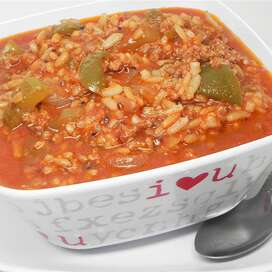
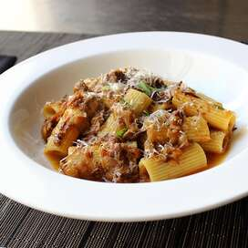
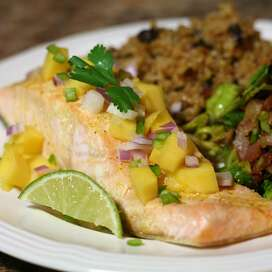

<h1 align="center">RECIPES</h1>

The website will consist of a main index page which will have links to a few recipes. The website won’t look very pretty by the time you’ve finished.

## Links

- [RECIPES](<https://ali-albousaifi.github.io/odin-recipes/>)

- [Lasagna](./recipes/lasagna.html)

- [Stuffed Green Pepper Soup](./recipes/Pepper_Soup.html)

- [Rigatoni alla Genovese](./recipes/Rigatoni_Genovese.html)

- [Salmon Curry](./recipes/Salmon_Curry.html)

## Screenshots

## Our project

In the project, we have:

### The recipe page should have the following content:

1. In the index.html file, add a link to the recipe page you just created. The text of the link should again be the recipe name.
2. An image of the finished dish under the h1 heading that you added earlier. You can find images of the dish on google or the site recipe site we linked to earlier.
3. Under the image, it should have an appropriately sized “Description” heading followed by a paragraph or two describing the recipe.
4. Under the description, add an “Ingredients” heading followed by an unordered list of the ingredients needed for the recipe.
5. Under the ingredients list, add a “Steps” heading followed by an ordered list of the steps needed for making the dish.

## Built With

- HTML

## Future Updates

- [ ] Adding some CSS Code.

## Author

**Ali Albousaifi**

- [Profile](https://github.com/Ali-Albousaifi "Ali Albousaifi")
- [Email](mailto:ali@tromail.com?subject=Hi "Hi!")
- [Website](https://tromail.com "Welcome")

## 🤝 Support

Contributions, issues, and advices are welcome!

Give a ⭐️ if you like this project!